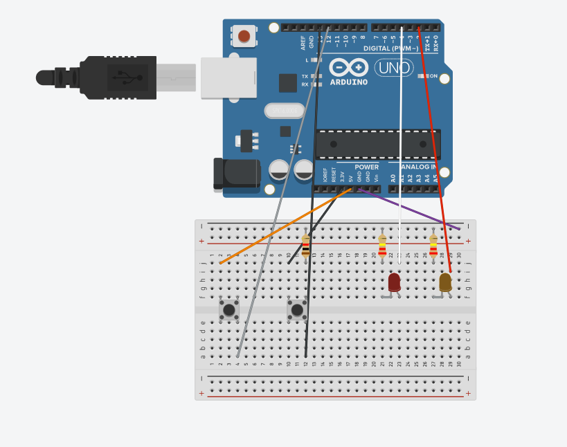

# BasicArduino

## Hello Arduino

```
//Jack Helmke
//November 24, 2020
//This code tells an LED to blink on and off every second.


  //Tells arduino what pin is led
int led = 13;

void setup() {
    Serial.begin(9600);   
    pinMode(led, OUTPUT); //Tells it that the led pin is an output
}

void loop() {
    digitalWrite(led, HIGH);  //Turns the led on
    delay(1000);              //Waits 1 second
    digitalWrite(led, LOW);   //Turns the led off
    delay(1000);              //Waits a second before repeating
}


```

It was fun to get started coding! It's tricky how precise you have to be with some things though, even on a small assignment like this.

[Arduino Code Link](https://create.arduino.cc/editor/jhelmke83/d0e1fae3-fb51-4115-a15f-b76e9aeb4ad8)

## Finite LED Blinker

```

//Jack Helmke
//November 24, 2020
//This code tells an LED to blink 5 times and stop


int led = 13;
int counter = 0; //sets a variable for how many times the led has blinked

void setup() {
  Serial.begin(9600);
  pinMode(led, OUTPUT);
}

void loop() {
   if(counter == 5){ //tells it to turn the led off after the set amount of blinks
     digitalWrite(led, LOW);
   }
   else{
     counter = counter + 1; //adds 1 to the counter every loop to keep track of the blinks
     digitalWrite(led, HIGH);
     delay(500);
     digitalWrite(led, LOW);
     delay(500);
   }
}

```

This was challenging! I more or less understood the variable part, so the tricky thing for me was actually getting it to stop after the 5 blinks. After a lot of troubleshooting I got it though!

[Arduino Code](https://create.arduino.cc/editor/jhelmke83/cd5b0698-023d-4d44-a811-29912050df26)

## Variable LED Blinker

```

//Jack Helmke
//November 25, 2020
//Makes a blinking led that speeds up as it goes, and eventually settles at .2 seconds.

int led = 13;
int delayVar = 2000; //Creates a variable for the delay between blinks

void setup() {
   Serial.begin(9600);
   pinMode(led, OUTPUT);
    
}

void loop() {
   if(delayVar == 200){ //tells it to keep blinking if the speed is down to .2 seconds
     Serial.println(delayVar);
     digitalWrite(led, HIGH);
     delay(200);
     digitalWrite(led, LOW);
     delay(200);
   }else{
     delayVar = delayVar - 200; //tells it to take away .2 seconds from the delay every time
     Serial.println(delayVar);
     digitalWrite(led, HIGH);
     delay(delayVar); //Delays it by the amount the delay variable is currently at
     digitalWrite(led, LOW);
     delay(delayVar);
   }
    
}

```

This was hard, but it was really cool to be able to directly use what I figured out last time to get the last part working! I'm enjoying doing the Arduino stuff so far, even though it's pretty tough sometimes.

[Code Link](https://create.arduino.cc/editor/jhelmke83/f56ff924-f2a0-46f3-85d8-90f9d3938f3c)

## Button-Activated LED

```

int ledPin = 2;
int buttonPin = 12;
int read = 0;

void setup() {
  Serial.begin(9600);
  pinMode(ledPin, OUTPUT);
  pinMode(buttonPin, INPUT);

}

void loop() {
   read = digitalRead(buttonPin);
   if(read == HIGH){
    Serial.println("Blink");
    digitalWrite(ledPin, HIGH);
    delay(250);
    digitalWrite(ledPin, LOW);
    delay(250);
  } else {
    digitalWrite(ledPin, LOW);
  }

}

```

It was tricky to get the button working, and it didn't help that I fell for the most classic arduino mistake ever- misplacing a wire and then spending a ton of time figuring out what's wrong with your code! I'll definitely be triple-checking all of my wiring from now on!

[Arduino Code](https://create.arduino.cc/editor/jhelmke83/97cff2c7-f1ce-4f6e-b8c9-39173ffa4b29)

## Two Buttons, Two LEDs


